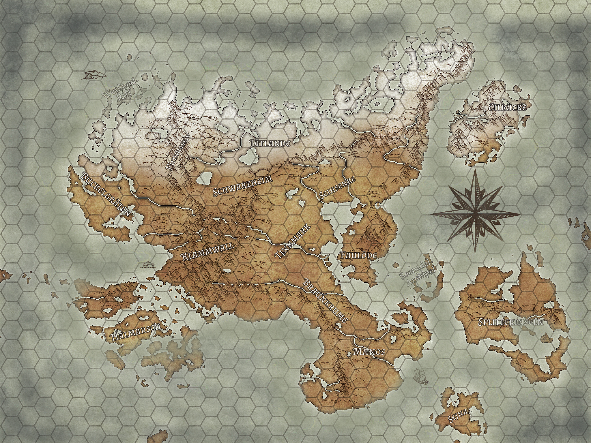

Hier eine Vorschau auf die Gefilde Mærhalls mit den wichtigsten Provinzen und Inseln. 

Im Süden erstreckt sich das Reich der Ænar von den Küstengebieten Mænos bis zur [[Braunkrume]], die durch den Fluss Pandoc von der Tinnmark im Norden begrenzt wird.
Die Halbinsel der Faulöde im Osten des Königsspiegels ist die Heimstätte der Zwerge. Einige ihrer Rohstoffe für ihre kunstfertigen Produktionen stammen aus dem Festland im Tal der Seihsenke. 

Nur wenige trauen sich in das Zentralmassiv der Insel, den Klammwall - Heimat der Freyborn. Einige besonders waghalsige Krieger sehen in dem in Schwarzheim gelegenen "Schlund" ein Paradies für Monsterjäger. Somit bleibt der eisige Norden der Insel nur über große Umwege oder Anstrengungen erreichbar.

Roadmap:
- Support für interaktives Ein- und Auszoomen in Karte