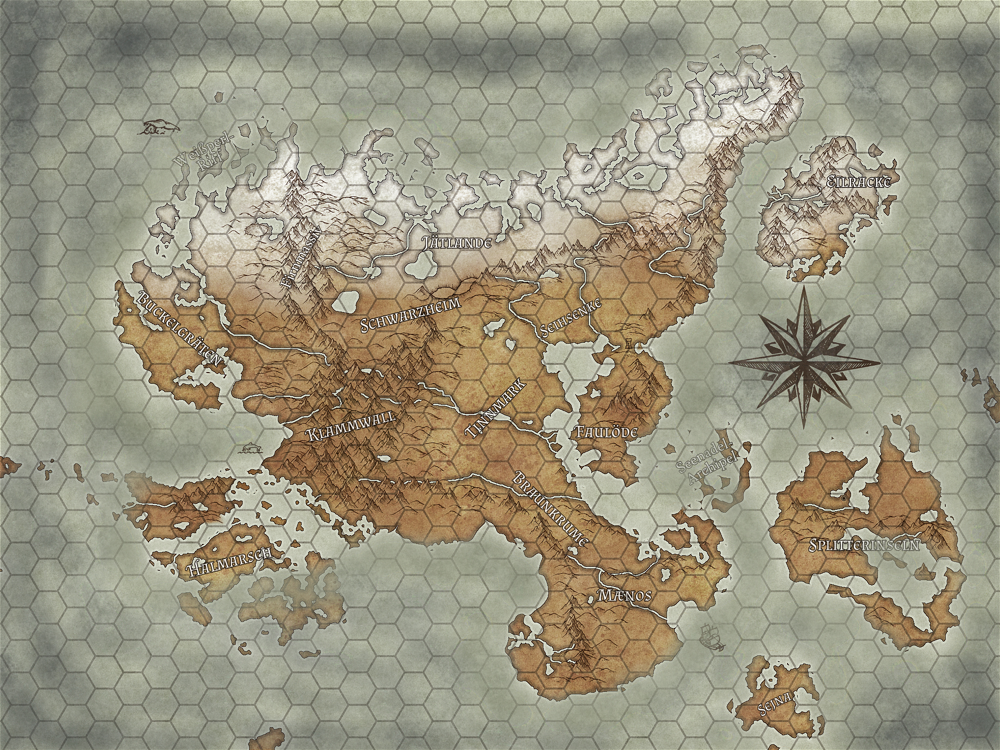
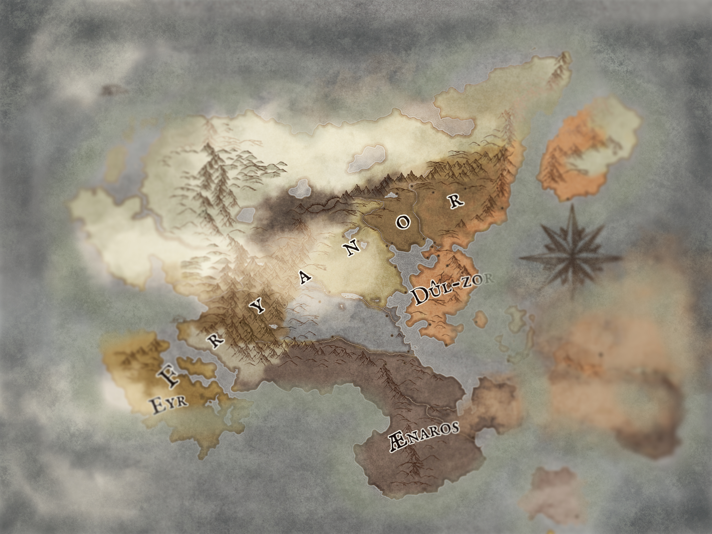

Hier eine Vorschau auf die Gefilde Mærhalls mit den wichtigsten Provinzen und Inseln. 

Im Süden erstreckt sich das Reich der Ænar von den Küstengebieten Mænos bis zur [[Braunkrume]], die durch den Fluss Pandoc von der Tinnmark im Norden begrenzt wird.
Die Halbinsel der [[Faulöde]] im Osten des [[Spiegelsee]]s ist die Heimstätte der Zwerge. Einige ihrer Rohstoffe für ihre kunstfertigen Produktionen stammen aus dem Festland im Tal der Seihsenke. 

Nur wenige trauen sich in das Zentralmassiv der Insel, den Klammwall - Heimat der [[Freyborn]]. Einige besonders waghalsige Krieger sehen in dem in Schwarzheim gelegenen "Schlund" ein Paradies für Monsterjäger. Somit bleibt der eisige Norden der Insel nur über große Umwege oder Anstrengungen erreichbar.

## Die politische Situation auf Mærhall

Die Landschaften Mærhalls wurden über die Jahrhunderte von Wind und Wetter ebenso erodiert wie durch politische Verwerfungen. Zwar fließt in den meisten Inselbewohnern das Blut der Frey, ihr einstiger Einflussbereich (Fryanor) ist jedoch zunehmend von innen ("Blutzoll der Freyborn") wie von außen ([[Schattenbrut]]) in Auflösung begriffen. 

Zufrieden unter ihresgleichen, handeln die alteingesessenen Zwerge von ihrer Domäne in Dûl-Zor mit allem, was über die entsprechenden Mittel verfügt. Intensiviert wurde der Handel mit dem Königreich [[Ænaros]] insbesondere nach Entdeckung des wichtigen Erzes "Rotmark", welches für dort für den Bau zahlreicher Apparaturen Anwendung findet.

 